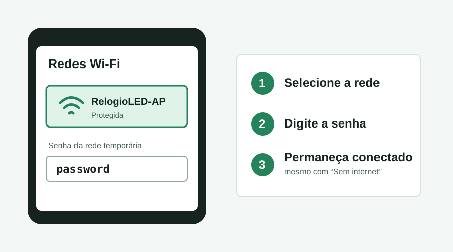
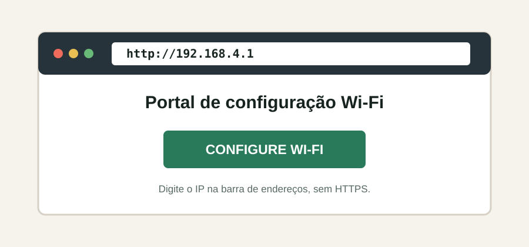
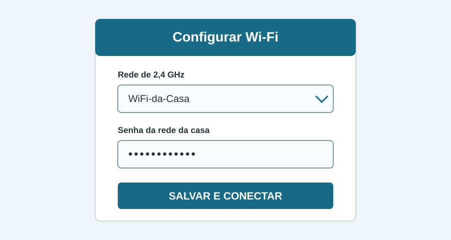
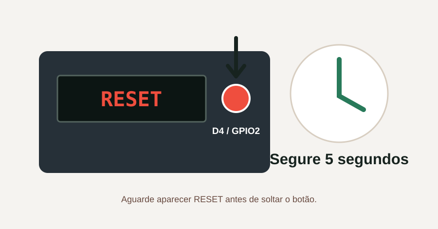

# Manual do usuário: configuração da rede Wi-Fi

Este manual explica como conectar o Relógio LED à rede Wi-Fi pela primeira vez e como trocar a rede salva posteriormente.

## Informações importantes

| Item | Valor padrão |
|---|---|
| Rede criada pelo relógio | **RelogioLED-AP** |
| Senha da rede do relógio | **password** |
| IP do portal de configuração | **192.168.4.1** |
| Endereço do portal | **http://192.168.4.1** |
| Tempo disponível para configurar | **5 minutos** |
| Login da atualização OTA | **admin** |
| Senha da atualização OTA | **admin** |

> **Atenção:** `password` é a senha para entrar na rede temporária **RelogioLED-AP**. A senha da rede Wi-Fi da sua casa é outra e deve ser informada no portal de configuração.

> **Sobre os IPs:** `192.168.4.1` é o IP padrão usado somente durante a configuração. Depois que o relógio se conecta ao roteador, ele recebe outro IP automaticamente. Esse novo IP não é fixo: ele aparece no display logo após a conexão.

## Tempos de cada ação

| Ação | Tempo esperado |
|---|---|
| Inicialização e mensagens no display | Aproximadamente **10 a 20 segundos** |
| Rede `RelogioLED-AP` aparecer no celular | Aproximadamente **5 a 15 segundos** após `SETUP` |
| Celular conectar à rede do relógio | Aproximadamente **5 a 20 segundos** |
| Portal abrir no navegador | Aproximadamente **2 a 10 segundos** |
| Procurar redes Wi-Fi próximas | Aproximadamente **5 a 15 segundos** |
| Digitar nome/senha e confirmar | Aproximadamente **1 a 2 minutos**, conforme o usuário |
| Limite total do portal de configuração | Exatamente **5 minutos** |
| Relógio conectar ao roteador após salvar | Aproximadamente **10 a 30 segundos** |
| IP permanecer passando no display | Aproximadamente **5 a 15 segundos** |
| Pressionar D4 para iniciar a indicação de reset | Mais de **0,5 segundo** |
| Manter D4 pressionado para confirmar o reset | Exatamente **5 segundos** |
| Reinício depois de apagar as configurações | Começa após **0,5 segundo**; conclusão em cerca de **10 a 20 segundos** |
| Procedimento completo na primeira conexão | Normalmente **2 a 4 minutos** |
| Procedimento completo para trocar de rede | Normalmente **3 a 5 minutos** |

Os tempos marcados como **aproximadamente** podem variar conforme o modelo do celular, intensidade do sinal, quantidade de redes próximas e velocidade do roteador. Os tempos de **5 minutos**, **5 segundos** e **0,5 segundo** são definidos pelo firmware.

## Antes de começar

- Tenha em mãos o nome e a senha da rede Wi-Fi que será usada.
- Use uma rede de **2,4 GHz**. O ESP8266 não se conecta a redes exclusivamente de 5 GHz.
- Deixe o celular ou computador próximo ao relógio e ao roteador.
- Não desligue o relógio enquanto a configuração estiver sendo salva.

## Primeira conexão

### 1. Ligue o relógio

Ao ligar, o display mostra as mensagens iniciais `HELLO` e `Despertador_RobertoCarlos`. Se ainda não houver uma rede salva, ele mostrará `SETUP` e criará a rede temporária **RelogioLED-AP**.

**Tempo esperado:** aguarde aproximadamente **10 a 20 segundos** para as mensagens iniciais. Depois de aparecer `SETUP`, a rede costuma ficar visível no celular em **5 a 15 segundos**.

### 2. Conecte o celular à rede do relógio

1. Abra **Configurações > Wi-Fi** no celular ou computador.
2. Procure a rede **RelogioLED-AP**.
3. Toque ou clique nessa rede.
4. Digite a senha **password**, toda em letras minúsculas.
5. Confirme a conexão.

**Tempo esperado:** o celular normalmente leva **5 a 20 segundos** para conectar. Permaneça nessa rede durante todo o procedimento, que deve ser concluído dentro do limite de **5 minutos**.



É normal aparecer o aviso **Sem internet**, pois essa rede serve apenas para configurar o relógio. Permaneça conectado a ela. Se o celular perguntar se deseja trocar para os dados móveis, escolha permanecer na rede Wi-Fi.

### 3. Abra o portal de configuração

O portal pode abrir automaticamente após a conexão. Se isso não acontecer:

1. Abra o navegador, como Chrome, Edge ou Safari.
2. Digite **http://192.168.4.1** na barra de endereços.
3. Não use `https` e não pesquise o endereço no Google.

**Tempo esperado:** o portal normalmente abre em **2 a 10 segundos**. Se não aparecer após **15 segundos**, atualize a página e confirme novamente o endereço.



### 4. Escolha a rede da casa

1. No portal, selecione a opção de configuração de Wi-Fi.
2. Aguarde a lista de redes próximas aparecer.
3. Selecione o nome da rede Wi-Fi desejada.
4. Digite a **senha dessa rede** com atenção a letras maiúsculas, minúsculas e símbolos.
5. Pressione o botão para salvar/conectar.

**Tempo esperado:** a busca de redes leva aproximadamente **5 a 15 segundos**. Reserve cerca de **1 a 2 minutos** para escolher a rede e digitar a senha com atenção.



### 5. Confirme a conexão

O ponto de acesso **RelogioLED-AP** desaparecerá quando a configuração terminar. O relógio se conectará ao roteador e mostrará no display uma mensagem semelhante a:

**Tempo esperado:** após salvar, aguarde aproximadamente **10 a 30 segundos** para a conexão. A passagem da mensagem com o IP pelo display costuma durar cerca de **5 a 15 segundos**; observe o display durante esse período.

```text
IP: 192.168.1.50
```

O número é apenas um exemplo. Anote o IP realmente mostrado no seu relógio. Em seguida:

1. Reconecte o celular à rede Wi-Fi normal da casa.
2. No navegador, abra `http://IP-DO-RELOGIO`, por exemplo `http://192.168.1.50`.
3. O painel principal do relógio deverá aparecer.

## Trocar a rede Wi-Fi

Use este procedimento quando trocar o roteador, o nome da rede ou a senha do Wi-Fi.

> **Atenção:** o procedimento implementado neste firmware apaga as credenciais Wi-Fi **e também formata a memória de configurações**. Será necessário configurar novamente alarme, horários do display, efeitos, chave da previsão do tempo e demais preferências.

1. Mantenha o relógio ligado.
2. Pressione e segure o botão ligado ao pino **D4 / GPIO2**.
3. Após cerca de meio segundo, o display inicia a contagem `RST 5s`, `RST 4s` e assim por diante.
4. Continue segurando durante **5 segundos**, até aparecer `RESET`.
5. Solte o botão e aguarde o relógio reiniciar.
6. Quando aparecer `SETUP`, repita o procedimento da seção **Primeira conexão**.

**Tempo esperado:** a indicação de reset começa depois de aproximadamente **0,5 segundo**. A confirmação ocorre ao completar **5 segundos** com o botão pressionado. O firmware inicia o reinício **0,5 segundo** depois de apagar as configurações, e o relógio normalmente volta a mostrar `SETUP` em **10 a 20 segundos**.



Se soltar o botão antes dos 5 segundos, o reset será cancelado e a rede salva continuará igual.

## Se não conectar

### A rede RelogioLED-AP não aparece

- Aguarde as mensagens iniciais terminarem e procure novamente.
- Desative e ative o Wi-Fi do celular.
- Aproxime-se do relógio.
- Se o relógio já estiver conectado a uma rede antiga, faça o procedimento **Trocar a rede Wi-Fi**.

### O portal não abre sozinho

- Confirme que o aparelho continua conectado à rede **RelogioLED-AP**.
- Ignore o aviso de rede sem internet.
- Desative temporariamente os dados móveis ou a troca automática de rede.
- Abra manualmente **http://192.168.4.1**.

### A configuração demorou mais de 5 minutos

O portal fecha após exatamente **5 minutos** sem concluir a conexão. Depois disso, o relógio aguarda **3 segundos**, reinicia e volta a oferecer a rede **RelogioLED-AP**. Aguarde aproximadamente **10 a 20 segundos** pela inicialização, conecte-se novamente e repita os passos.

### O relógio volta a mostrar SETUP

Normalmente isso indica nome de rede ou senha incorretos, sinal fraco ou rede incompatível. Confira a senha e confirme que a rede aceita dispositivos de 2,4 GHz.

### Esqueci o IP recebido do roteador

- Reinicie o relógio sem apagar as configurações e observe o IP exibido após a conexão.
- Como alternativa, consulte a lista de dispositivos conectados no painel do roteador.

## Acesso à atualização do firmware

Com o relógio conectado à rede da casa, a tela de atualização fica em:

```text
http://IP-DO-RELOGIO/update
```

Quando solicitado, use:

- **Login:** `admin`
- **Senha:** `admin`

Essas credenciais protegem apenas a página de atualização OTA. Elas não servem para entrar em **RelogioLED-AP** nem substituem a senha da rede da casa.